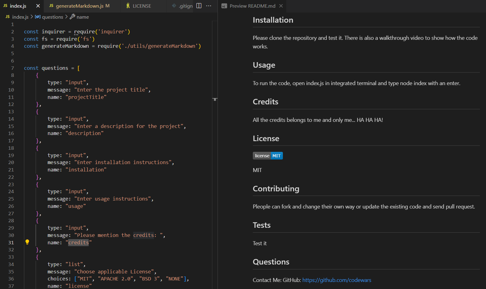

## Professional README Gen
  ## Description
  When creating an open source project on GitHub, it’s important to have a high-quality README file. This generator will quickly and easily generate a README file by using a command-line application.
  ## Table of Contents
  - [Installation](#installation)
  - [Usage](#usage)
  - [Credits](#credits)
* - [License](#license)
  - [Contributing](#contributing)
  - [Tests](#tests)
  - [Questions](#questions)
  ## Installation
  To install please use VSCode and node.js
  ## Usage
  This application can be used to create Professional README pages for different homeworks / projects.
  Here are the sample screenshots
- Screenshot : Initial Pages

- Screenshot : GIF Version 

- Screenshot: Walkthrough Video

  ## Credits
  Apart from me, the credit goes to my instructor, TAs and Tutor.
  
  ## License
   

  MIT
  ## Contributing
  People can update my code.
  ## Tests
  To test please us VSCode and CLI
  ## Questions
  Contact Me:
  - Email: abc@gmail.org
  - GitHub: https://github.com/thalim-glam 

   ## License 
    This application was licensed under the MIT license.
  	

